# Wireless Assessment Center

A WiFi-Pineapple-style **wireless security assessment platform** that runs entirely on a
consumer OpenWrt router. It turns a TP-Link Archer C7 into a self-contained lab for
authorized Wi-Fi auditing — reconnaissance, handshake/PMKID capture, WPS and dictionary
cracking, rogue-AP / captive-portal exercises, and on-device MITM/DNS analysis — all driven
from a single web dashboard.

Built as a native module for the [Frieren](https://github.com/xchwarze/frieren) OpenWrt
pentest framework: a ~5,900-line PHP backend and a ~3,400-line React frontend exposing
~45 API actions.

> ### ⚠️ Legal & authorized-use notice
>
> This project is for **education and authorized security testing only**. Attacking,
> intercepting, or capturing traffic from wireless networks you do not own or do not have
> **explicit written permission** to test is illegal in most jurisdictions.
>
> It was built and tested exclusively against the author's **own** router and network in an
> isolated home lab. The tooling includes an **authorization flag** on every target and a
> single-target BPF filter specifically so that assessment activity stays scoped to a
> network you control. **You are solely responsible for how you use it.** Do not use it
> against networks or people without permission.

---

## Why I built it

Off-the-shelf Wi-Fi audit hardware (e.g. the WiFi Pineapple) is a purpose-built appliance.
I wanted to understand what actually makes one work, so I rebuilt the core capabilities on a
$40 router I already owned — learning the OpenWrt radio/`netifd`/UCI stack, the aircrack-ng
and hcxtools pipelines, `nftables`, captive-portal internals, and how to wrap all of it in a
safe, beginner-friendly control plane. Everything below runs on a single-core MIPS SoC with
~121 MB of RAM, which made resource discipline part of the problem.

## Screenshots

> The module running live on the Archer C7. **Network names (SSIDs), BSSIDs, and MAC
> addresses are masked** in these images — the tooling only ever ran against the author's
> own hardware, and no third-party network data is published.

<p align="center">
  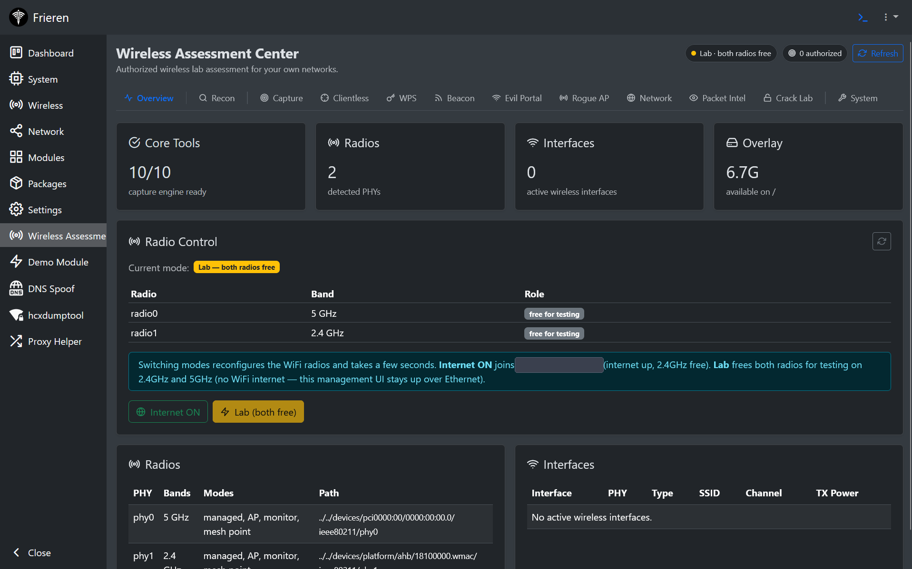<br>
  <sub><b>Overview</b> — tabbed workspace, live radio-mode control (Internet uplink vs. Lab), and tool readiness at a glance.</sub>
</p>

<table>
<tr>
<td width="50%" valign="top">
  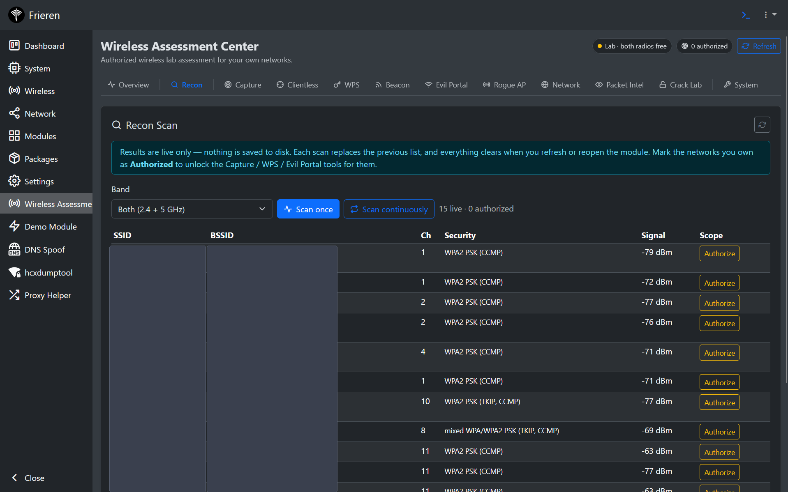<br>
  <sub><b>Recon</b> — live dual-band scanner; only networks you mark as <i>Authorized</i> unlock the attack tools.</sub>
</td>
<td width="50%" valign="top">
  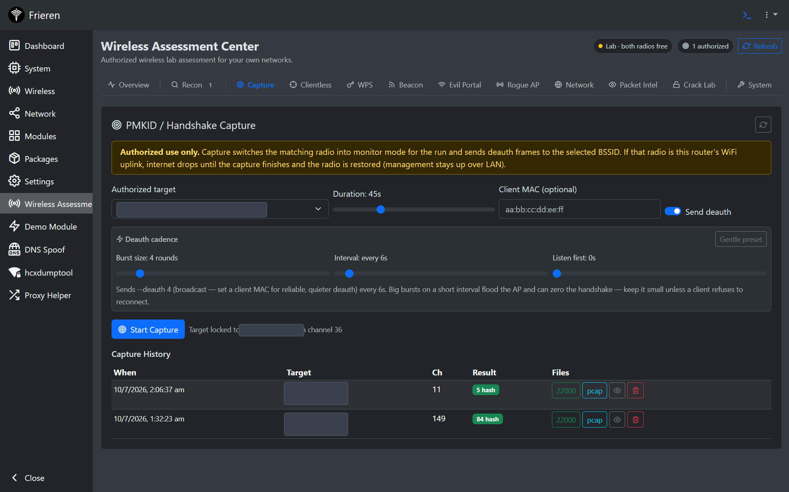<br>
  <sub><b>Capture</b> — WPA handshake / PMKID capture with a tunable deauth cadence and capture history.</sub>
</td>
</tr>
<tr>
<td width="50%" valign="top">
  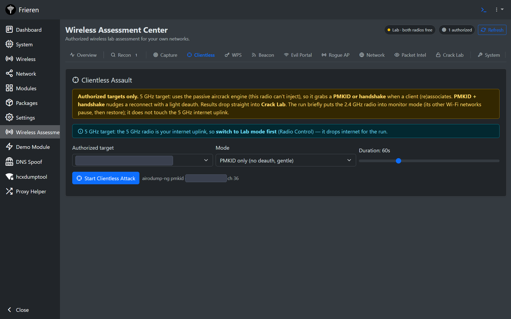<br>
  <sub><b>Clientless</b> — grabs a PMKID or handshake when a client (re)associates; drops straight into Crack Lab.</sub>
</td>
<td width="50%" valign="top">
  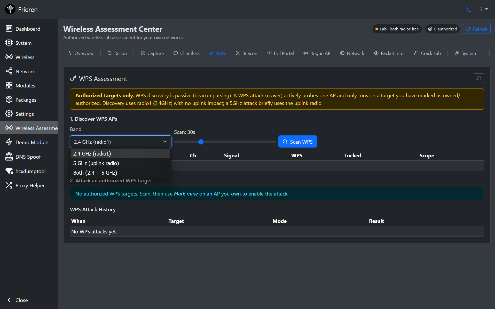<br>
  <sub><b>WPS</b> — passive WPS discovery (beacon-IE parsing) and reaver / pixie-dust assessment.</sub>
</td>
</tr>
<tr>
<td width="50%" valign="top">
  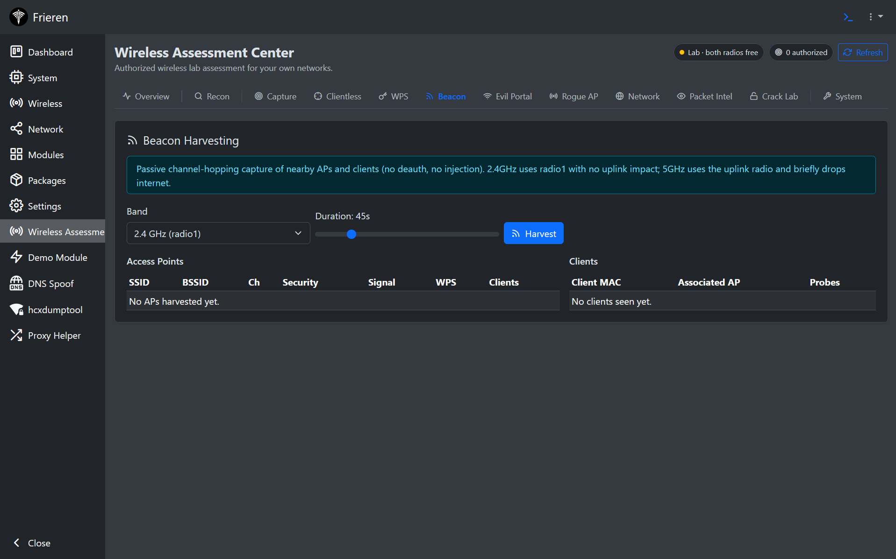<br>
  <sub><b>Beacon Harvesting</b> — passive AP + client collection (probe/PNL lists), no injection.</sub>
</td>
<td width="50%" valign="top">
  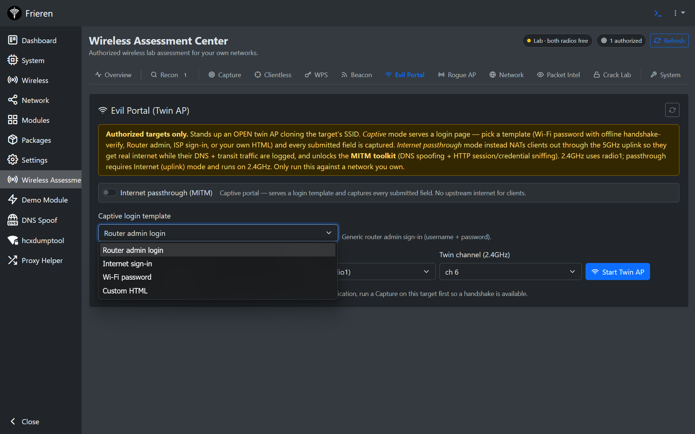<br>
  <sub><b>Evil Portal</b> — open twin AP with captive-portal templates or internet-passthrough MITM.</sub>
</td>
</tr>
<tr>
<td width="50%" valign="top">
  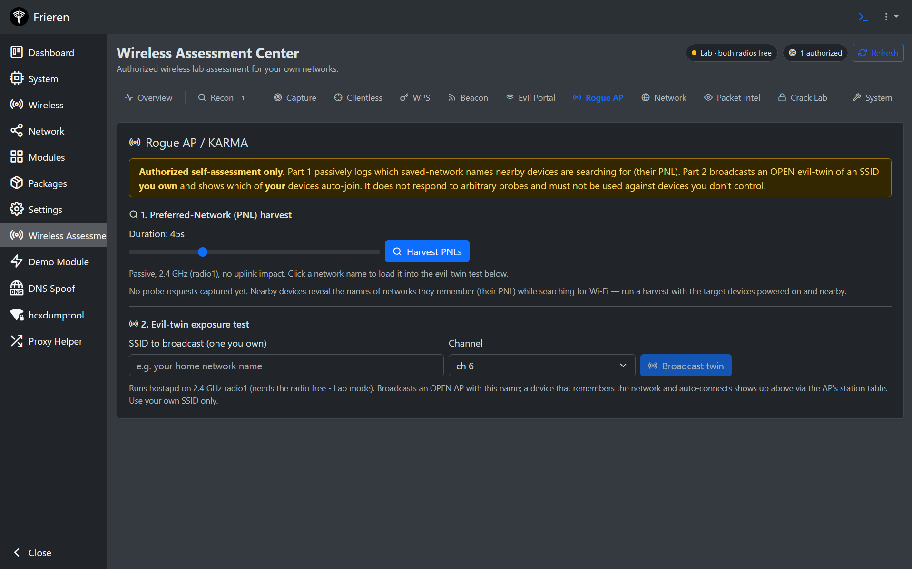<br>
  <sub><b>Rogue AP / KARMA</b> — PNL harvest and an evil-twin exposure test for devices you own.</sub>
</td>
<td width="50%" valign="top">
  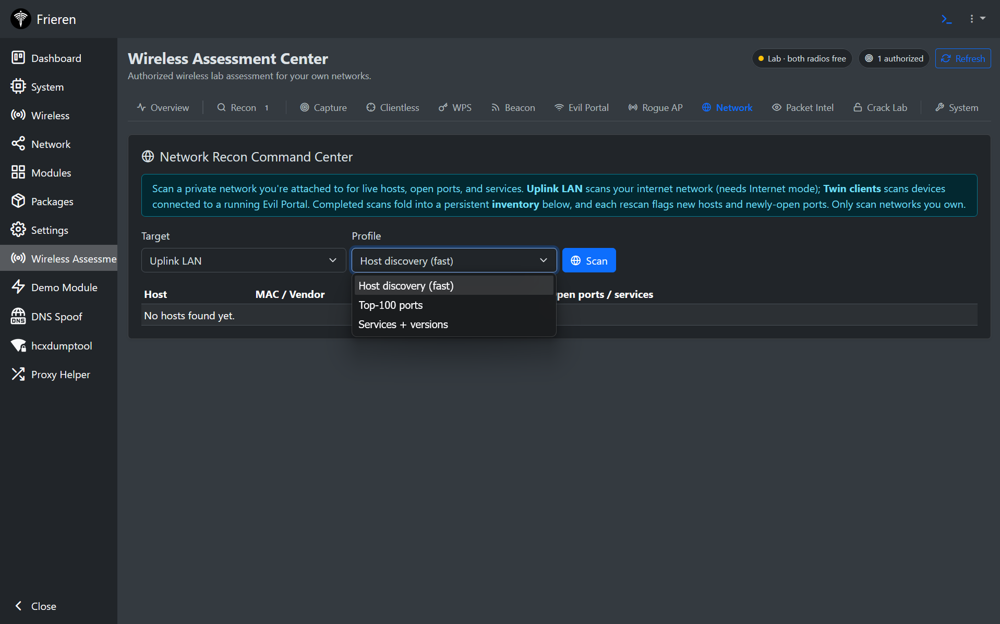<br>
  <sub><b>Network Recon</b> — nmap host discovery, port and service scans folded into a persistent inventory.</sub>
</td>
</tr>
<tr>
<td width="50%" valign="top">
  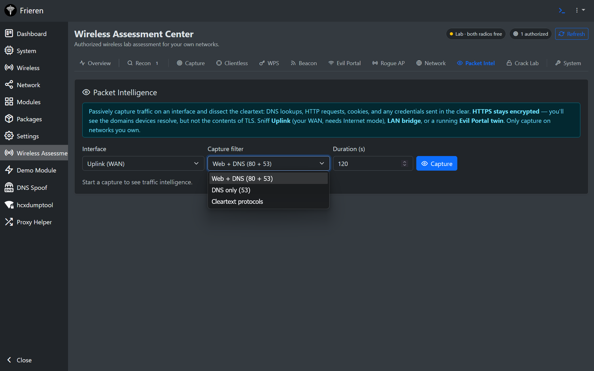<br>
  <sub><b>Packet Intelligence</b> — passive cleartext dissection: DNS, HTTP, cookies, and credentials sent in the clear.</sub>
</td>
<td width="50%" valign="top">
  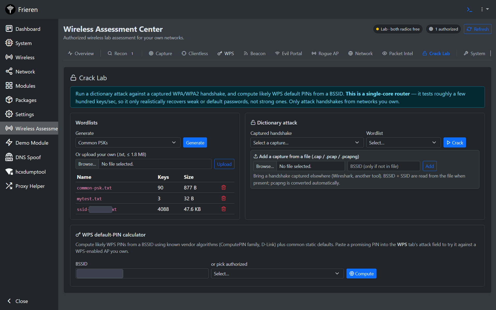<br>
  <sub><b>Crack Lab</b> — dictionary attacks, wordlist generation/upload, and a WPS default-PIN calculator.</sub>
</td>
</tr>
</table>

## Features

**Reconnaissance**
- Target-centric recon database — every seen AP is tracked over time (first/last seen,
  signal history) with a per-target **authorized** flag, label, and notes.
- Live scanning across both radios; WPS capability/lock detection.

**Handshake & PMKID capture**
- WPA/WPA2 4-way handshake capture (`airodump-ng` + light, targeted `aireplay-ng` deauth).
- **Clientless PMKID** capture via `hcxdumptool`, scoped to a single BSSID by a compiled
  Berkeley Packet Filter so nothing else on the band is touched.
- Automatic conversion to hashcat `22000` / aircrack formats for cracking.

**Cracking lab**
- Dictionary attacks with `aircrack-ng`; custom wordlist upload and on-device generation.
- Upload external `.cap/.pcap/.pcapng` handshakes to crack; automatic BSSID/ESSID
  detection.

**WPS**
- `wash` scanning, `reaver` online attacks with pixie-dust (`pixiewps`), and offline WPS
  PIN computation, with live reaver output and timeout handling.

**Rogue AP / captive portal**
- Evil-Portal captive portal (`hostapd` + `dnsmasq` + `uhttpd`) with selectable templates,
  OS captive-portal auto-dismiss, and a live client/traffic view.
- Beacon-harvest and Karma-style probe-response modes.

**On-device MITM / DNS (analysis & awareness)**
- Per-domain DNS rules on a dedicated resolver: **notice**, **redirect** (302 to any URL),
  or **clone** — a phishing-awareness login clone that captures submitted fields and then
  shows the visitor a "this was a simulated test" disclosure page.
- HTTP session/cred sniffing on the portal interface via `tcpdump`.
- All changes are scoped to a dedicated `nftables` table/interface and cleanly torn down;
  the box's normal DNS and NAT are never disturbed. (HTTPS/HSTS limits are documented
  honestly in the UI — this is not sslstrip.)

**Beginner-friendly control plane**
- A redesigned Wireless tab with plain-language tabs (Internet / My Networks / Connected
  Devices / Advanced) so radio, uplink, and monitor/AP mode management is approachable —
  without hiding the raw UCI editor from advanced users.

See [`docs/ARCHITECTURE.md`](docs/ARCHITECTURE.md) for how the backend, job model, radio
management, and safety mechanics fit together.

## Tech stack

| Layer      | Technology                                                              |
|------------|-------------------------------------------------------------------------|
| Backend    | PHP (Frieren `Controller` pattern), OpenWrt UCI / `netifd`, POSIX shell |
| Frontend   | React 18, Jotai, react-query, react-bootstrap (Frieren UMD runtime)     |
| Wireless   | aircrack-ng suite, hcxdumptool/hcxtools, reaver, pixiewps, wash         |
| Networking | hostapd, dnsmasq, uhttpd, nftables, `iw`, `tcpdump`                      |
| Platform   | OpenWrt 24.10 on ath79 / QCA956X (32-bit big-endian MIPS)               |

## Hardware / requirements

- An OpenWrt 24.10 device with two Wi-Fi radios (developed on a **TP-Link Archer C7 v5**).
- The [Frieren](https://github.com/xchwarze/frieren) framework installed.
- The wireless toolchain available as OpenWrt packages: `aircrack-ng`, `hcxdumptool`,
  `hcxtools`, `reaver`, `pixiewps`, `hostapd-utils`, `dnsmasq`, `tcpdump`, `nftables`.

## Install

If you already run [Frieren](https://github.com/xchwarze/frieren), this installs as a drop-in
module — Frieren auto-discovers any folder with a `manifest.json` under its modules root. The
ready-to-install folder is `dist/wireless_assessment/` (just the three files the device needs).

```bash
git clone https://github.com/Hmkz0x00/wireless-assessment-center.git
cd wireless-assessment-center

# 1. Install the tool dependencies on the device (once):
#    opkg update && opkg install aircrack-ng hcxdumptool hcxtools reaver pixiewps \
#        hostapd-utils dnsmasq tcpdump nftables nmap iw kmod-tun

# 2. Copy the module folder onto the device (name must stay "wireless_assessment"):
scp -r dist/wireless_assessment root@ROUTER_IP:/frieren/modules/
```

Reload the panel — **Wireless Assessment Center** appears in the sidebar (and on the Modules
page). Prefer no-scp, SD-card, or on-device `wget` installs? See the full, step-by-step
**[installation guide → `docs/INSTALL.md`](docs/INSTALL.md)** (covers dependencies, storage
options, uninstall, and troubleshooting).

> Not in the panel's one-click "Available modules" list because that catalog serves only the
> official upstream modules; third-party modules install manually as above.

If you edit the UI source, rebuild the bundle and repackage:

```bash
node --check src/module.umd.source.js
gzip -9 -n -c src/module.umd.source.js > src/module.umd.js
sh scripts/package.sh        # refreshes dist/wireless_assessment/ + tarball
```

## Project structure

```
src/
  Wireless_assessmentController.php   # PHP backend — ~45 API actions, job engine, tool wiring
  module.umd.source.js               # React frontend (authored source)
  module.umd.js                      # gzipped bundle served by the device
  manifest.json                      # Frieren module manifest
dist/
  wireless_assessment/               # ready-to-install module folder (drop into /frieren/modules/)
scripts/
  package.sh                         # assembles dist/ + tarball from src/
docs/
  INSTALL.md                         # step-by-step install guide for existing Frieren users
  ARCHITECTURE.md                    # design, job model, radio management, safety mechanics
```

## Status

Functional and used on the author's own lab device. Runtime data (captures, recon results,
credential logs) is intentionally **not** part of this repo — it stays on the device and is
excluded via `.gitignore`.

## Credits

- Built on the [**Frieren**](https://github.com/xchwarze/frieren) OpenWrt pentest framework
  by [@xchwarze](https://github.com/xchwarze).
- Uses the [aircrack-ng](https://www.aircrack-ng.org/) suite, ZerBea's
  [hcxdumptool/hcxtools](https://github.com/ZerBea/hcxdumptool),
  [reaver](https://github.com/t6x/reaver-wps-fork-t6x), and
  [pixiewps](https://github.com/wiire-a/pixiewps).

## License

Released under the [MIT License](LICENSE).
